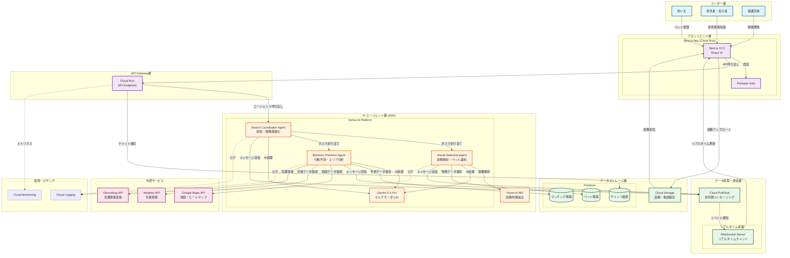
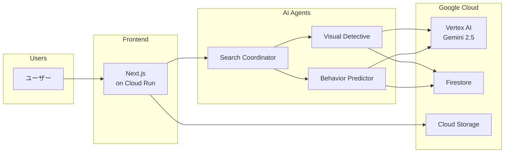

# PawMate システムアーキテクチャ図

## アーキテクチャ図（Mermaid形式）

## 簡略版アーキテクチャ（プレゼン用）

## アーキテクチャ説明ポイント

### 1. マルチエージェント協調システム
- **ADK (Agents Development Kit)** を使用し、3つの専門AIエージェントが協調動作
- **Pub/Sub** による非同期通信でスケーラブルな処理を実現
- 各エージェントは独立して動作し、必要に応じて連携

### 2. リアルタイム性の確保
- **WebSocket** によるリアルタイムチャット機能
- **Firestore** のリアルタイム同期機能を活用
- 位置情報やマッチング結果の即座な通知

### 3. スケーラビリティ
- **Cloud Run** の自動スケーリング機能
- サーバーレスアーキテクチャで負荷に応じた柔軟な対応
- **Cloud Storage** による大量画像データの効率的な管理

### 4. AI処理の最適化
- **Gemini 2.5 Pro** によるマルチモーダル処理
- **Vision AI API** による高速な画像特徴抽出
- エッジケースに対応する柔軟なAI処理

### 5. データセキュリティ
- **Firebase Auth** による認証管理
- プライバシーを考慮したデータアクセス制御
- 個人情報の適切な暗号化と管理

## 主要なデータフロー

### ペット登録フロー
1. 飼い主が迷子ペット情報を登録
2. Visual Detective Agentが画像を解析
3. Behavior Predictorが初期予測エリアを生成
4. データをFirestoreに保存
5. Search Coordinatorが捜索戦略を立案

### 発見・マッチングフロー
1. 発見者が画像と位置情報を投稿
2. Visual Detective Agentが既存データと照合
3. 高スコアマッチの場合、飼い主に通知
4. チャット機能で直接連絡可能に

### 捜索最適化フロー
1. 時間経過と共にBehavior Predictorが予測を更新
2. 天候・時間帯データを取得して分析
3. Search Coordinatorが戦略を動的に調整
4. ヒートマップをリアルタイム更新

## 技術選定の理由

- **Cloud Run**: サーバーレスで運用コストを最適化
- **Vertex AI**: 統合されたMLプラットフォームで開発効率向上
- **ADK**: マルチエージェントシステムの構築を簡素化
- **Firestore**: NoSQLでフレキシブルなデータ構造
- **Pub/Sub**: 疎結合なマイクロサービス間通信